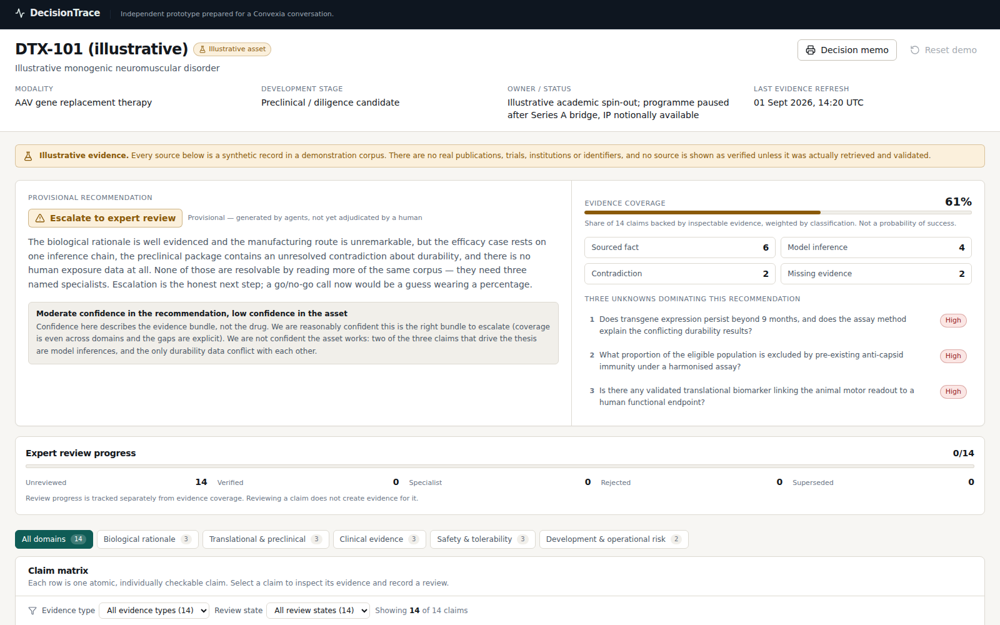
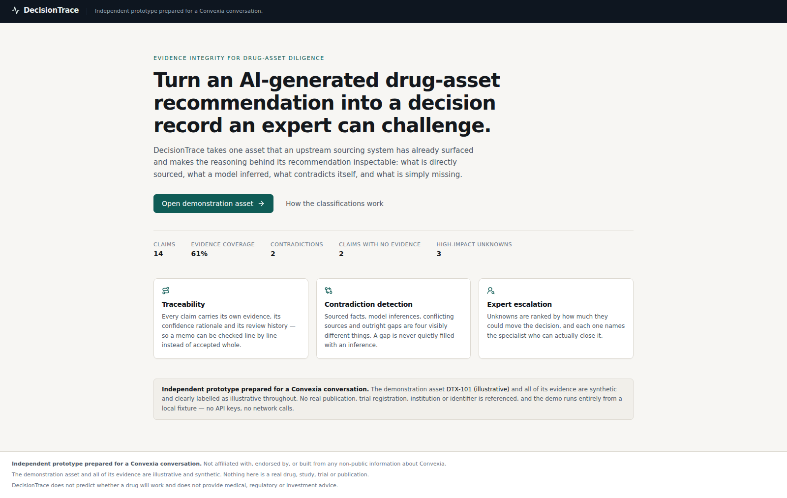
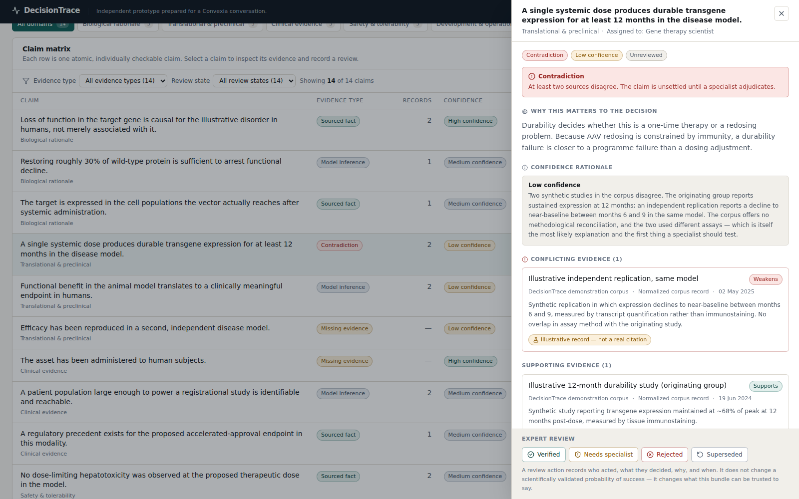

# DecisionTrace — Evidence Integrity for Drug-Asset Diligence

> **Independent prototype prepared for a Convexia conversation.** Not affiliated with, endorsed by, or built from any non-public information about Convexia. The default asset and every source in it are illustrative and synthetic.

DecisionTrace turns an AI-generated drug-asset recommendation into an **evidence-linked, uncertainty-aware decision record** that a scientific expert can inspect, challenge and approve.



---

## What this demonstrates

Finding an asset is the beginning of a diligence problem, not the end of one. Before a go/no-go call, someone has to separate:

- what a source actually states,
- what a model inferred from adjacent evidence,
- where sources contradict each other,
- and what nothing in the bundle addresses at all.

A well-written memo hides those distinctions, because a sourced fact and a plausible inference read identically in prose. DecisionTrace makes the reasoning structure visible: every claim is individually classified, evidenced, and reviewable, and the unknowns most likely to change the recommendation are ranked at the top rather than buried in the longest section.

**The demonstration path:** open one illustrative asset → see a provisional "escalate to expert review" recommendation with 61% evidence coverage and three dominating unknowns → filter to the contradictory claims → open one → read what supports it, what a model inferred, and what conflicts with it → mark it for specialist review with a rationale → watch the audit trail record who decided what, why and when → reset.

## Why it is relevant to AI-assisted drug diligence

An agent pipeline that sources and scores assets eventually runs into the same wall: a pharma BD team, an investor or a regulator will not act on a score they cannot interrogate. The value is in the handoff — making agent output defensible, directing scarce specialist attention at the uncertainty that actually moves a decision, and capturing expert adjudication as a durable record. That record is also the raw material for evaluation: disagreements between agent output and expert judgement are exactly the dataset you need to improve the agents.

DecisionTrace is a prototype of that handoff layer. It deliberately does **not** attempt to reproduce asset sourcing or probability-of-success modelling.

### What it does not claim

- It does not predict whether a drug will work.
- It does not replace scientists, clinicians, regulatory experts or investors.
- It does not provide medical, regulatory or investment advice.
- It does not reproduce any proprietary sourcing or scoring system.
- It contains no fabricated scientific sources, quotations, trial results or confidence values.

---

## Local setup

Requires Node.js 20.9+ (developed on Node 22).

```bash
npm install
npm run dev          # http://localhost:3000
```

Open <http://localhost:3000> and click **Open demonstration asset**.

No API key, environment variable, database or network access is needed for the full demonstration. After `npm install`, everything runs offline.

### Test and build commands

```bash
npm run lint          # ESLint (flat config, next/core-web-vitals + TypeScript)
npm run typecheck     # tsc --noEmit, strict mode
npm test              # Vitest unit + component tests (109 tests)
npm run test:e2e      # Playwright smoke suite (10 tests; builds and serves automatically)
npm run build         # production build
npm run format        # Prettier write
npm run format:check  # Prettier check
npm run verify        # format:check → lint → typecheck → test → build
```

`npm run test:e2e` builds the app and starts a server on port 3100 itself. If Playwright's own browser download is unavailable, the config falls back to a Chromium already present under `PLAYWRIGHT_BROWSERS_PATH`, or to `CHROMIUM_PATH` if you set it explicitly.

---

## Architecture

```
src/
  app/
    page.tsx                    landing route
    assets/[assetId]/page.tsx   the decision workspace (SSG for the demo asset)
    methodology/page.tsx        how classification, coverage and review work
    api/sources/route.ts        server-only source lookup; disabled by default
  domain/
    schema.ts                   Zod schemas + inferred types (the domain model)
    coverage.ts                 evidence-coverage calculation and derived counts
    labels.ts                   display metadata; text labels for every status
  data/
    demo-asset.ts               the illustrative DTX-101 fixture
    index.ts                    getDemoAsset(), validating on read
  state/
    workspace-store.ts          review state (useSyncExternalStore + localStorage)
    print-timestamp.ts          hydration-safe memo timestamp
  sources/
    types.ts                    SourceAdapter interface
    clinicaltrials.ts           ClinicalTrials.gov API v2 adapter
  components/
    ui/                         Badge, Card, Button, Drawer, Meter, EmptyState
    layout/                     app shell, disclaimers, illustrative banner
    workspace/                  header, decision summary, claim matrix, evidence
                                drawer, review controls, unknowns, audit, memo
tests/
  unit/                         Vitest (schema, coverage, filtering, drawer,
                                review, unknowns, memo, adapter)
  e2e/                          Playwright smoke suite
```

**Stack:** Next.js 16 (App Router) · React 19 · TypeScript strict · Tailwind CSS v4 · Zod · lucide-react · Vitest + Testing Library · Playwright. No database, no authentication, no model provider.

### Key design decisions

- **Every number is derived.** Domain counts, classification counts, coverage, filter counts and the "showing N of M" line all come from one `summarizeAsset()` call over the current claim list. A test asserts the derived coverage equals the value stated on the recommendation, so the two cannot silently diverge.
- **Review state is separate from the fixture.** Reviewer actions live in an external store mirrored to `localStorage`; applying them never mutates the fixture. `useSyncExternalStore` is used so the server snapshot is the pristine fixture and hydration cannot mismatch.
- **Illustrative records are unlinked.** A source becomes linked and labelled "Verified source" only when an adapter actually retrieved it and it passed validation. Nothing else can be.

---

## Data model

```ts
Asset          id, name, indication, modality, developmentStage, ownerStatus,
               updatedAt, isIllustrative, recommendation, claims[], unknowns[],
               auditEvents[]

Claim          id, domain, text, classification, confidence, confidenceRationale,
               decisionRelevance, reviewStatus, reviewerType, lastReviewedAt,
               evidence[]

EvidenceItem   id, title, sourceType, publisher, publishedAt, url?, summary,
               relationship (supports | weakens | context), isIllustrative,
               retrievedAt?

CriticalUnknown id, question, impact, rationale, requiredReviewer, linkedClaimIds[]

Recommendation  status, label, rationale, coveragePercent, confidenceLabel,
                confidenceExplanation

AuditEvent      id, actor, actorType (agent | human | system), action, rationale,
                timestamp, claimId?
```

**Evidence classifications:** `direct_support` (a record states it) · `model_inference` (reasoning, no source states it) · `contradiction` (sources disagree) · `missing_evidence` (nothing addresses it).

**Review states:** `unreviewed` · `verified` · `needs_specialist` · `rejected` · `superseded`.

**Evidence coverage** — documented in `src/domain/coverage.ts`, printed in the decision memo, and unit-tested:

```
weight: direct_support 1.00 | model_inference 0.50 | contradiction 0.25 | missing_evidence 0.00
coveragePercent = round(100 × Σ weight(claim) / claimCount)
```

Coverage measures how much of the claim set is backed by inspectable evidence. **It is not a probability of technical, clinical or regulatory success** and it does not encode scientific quality. Human review progress is reported as a separate figure, because reviewing a claim does not create evidence for it.

---

## Limitations

- **The default asset is synthetic.** `DTX-101 (illustrative)` is not a real programme. Its sources are records in a demonstration corpus: no PubMed IDs, DOIs, trial registrations, real institutions or quotations, enforced by a test that scans the serialized fixture. Illustrative records carry a badge and no link, so they cannot be mistaken for citations.
- **No live source snapshot is bundled.** The `SourceAdapter` interface and a ClinicalTrials.gov API v2 adapter are implemented and unit-tested against both success and every failure mode, but the build environment blocks all non-registry egress, so no real response could be retrieved — and one was not fabricated. Run with `DECISIONTRACE_ENABLE_LIVE_SOURCES=true` on a machine with internet access to exercise it: `GET /api/sources?term=<condition>`.
- **Review state is per browser.** No database, no authentication, no shared workspace. Two people reviewing the demo do not see each other's actions.
- **The reviewer identity is a fixed demo string.** A real deployment would take it from an authenticated session.
- **Export is a print stylesheet**, not a PDF pipeline. `Decision memo` opens the browser print dialog; the app is suppressed and the memo prints alone.
- **No model integration.** The optional evidence-classification route was deliberately not built; the deterministic path is the product.

---

## Future integration possibilities

- Receive candidate assets from an upstream sourcing agent instead of a fixture.
- Ingest evidence bundles directly from scientific-evaluation models, preserving each model's own classification and confidence.
- Version evidence over time, so a reviewer sees what changed since the last decision rather than a fresh snapshot.
- Compare agent recommendations against expert adjudication and report where they diverge.
- Measure which uncertainty categories most often flip a decision, and route future specialist attention accordingly.
- Build evaluation datasets from reviewer disagreements — the cheapest high-quality training signal a diligence system produces.
- Add reviewer identity, org-level audit export and per-claim assignment for multi-expert workflows.

---

## Screenshots

|                                                  |                                                                  |
| ------------------------------------------------ | ---------------------------------------------------------------- |
|  |  |
| Landing                                          | Evidence drawer, contradiction shown before support              |

See [`DEMO_SCRIPT.md`](DEMO_SCRIPT.md) for a 60–90 second walkthrough and [`PROGRESS.md`](PROGRESS.md) for the milestone-by-milestone build record.
